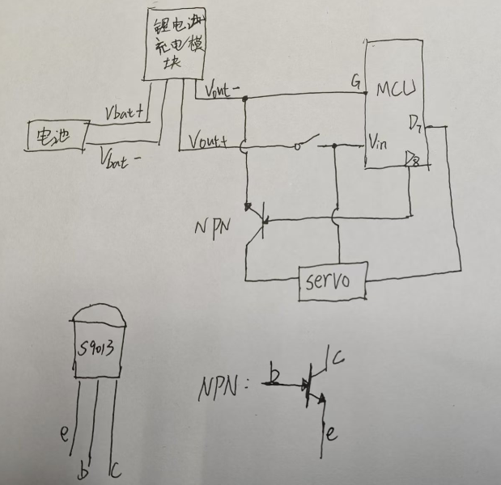
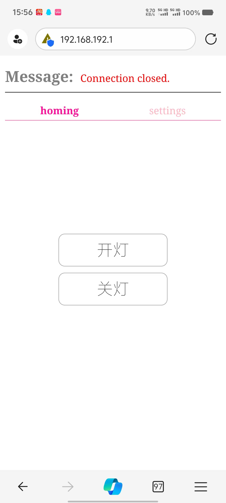
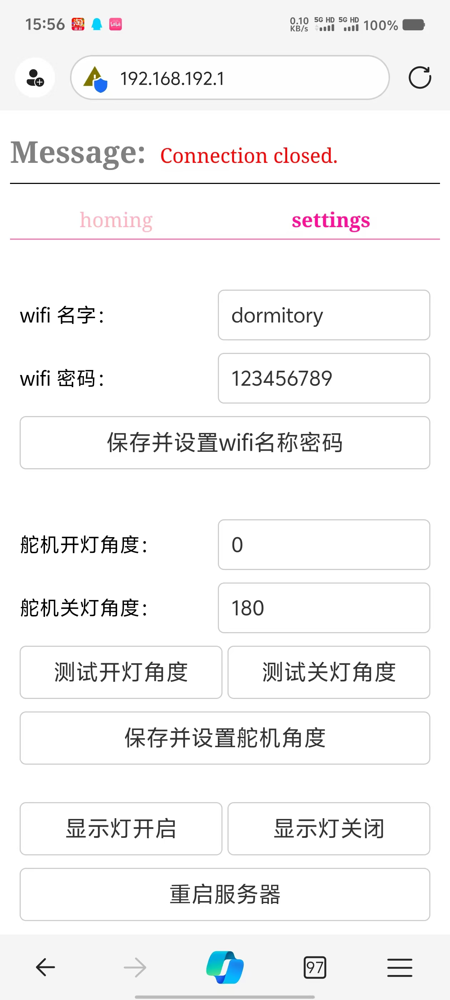

# 项目概述
这是一个用于在寝室中不用下床开关灯的， 将esp8266作为服务器，通过手机web端进行控制舵机运动从而拨动开关的一个项目。

# 功能
1.使用电池，可以实现断电后继续运行

2.支持充电功能

3.使用wifi传输数据

# 物料清单
## 材料
-----------------
|              物料名称              | 数量  |
| :--------------------------------: | :---: |
|           esp8266开发板            |   1   |
|                导线                | 若干  |
|              sg90舵机              |   1   |
|            SS12F48开关             |   1   |
|          M2x10十字头螺栓           |   8   |
|               M2螺母               |   4   |
|           M3x5十字头螺栓           |   2   |
|        tp4056锂电池充电模块        |   1   |
|            18650锂电池             |   1   |
|      18650正负极电池片(一对)       |   2   |
|          s9013三极管(npn)          |   1   |
| 3d打印外壳配件-框架底座(./stl目录) |   1   |
| 3d打印外壳配件-电池盖子(./stl目录) |   1   |
> Note

可以访问：https://makerworld.com/zh/models/832762#profileId-777419 
使用A1Mini 通过bambuStudio打开从而进行打印

## 工具
-----------------
|   工具名称   | 数量  |
| :----------: | :---: |
|     锡膏     |   1   |
|    烙铁丝    |   1   |
|    电烙铁    |   1   |
| 剥线钳(可选) |   1   |
| 十字头螺丝刀 |   1   |

# 代码下载使用
1.确保电脑安装了`arduino IDE`

2.确保在`arduino IDE`中配置了`esp8266`的环境

3.下载相关库文件
```c
ESPAsyncTCP
ESPAsyncWebServer
ArduinoJson
Servo
```

4.将代码文件`./program/program.ino`上传到esp8266中


# 电路连接图


# web端的使用说明

1. 手机连接到esp8266的wifi，默认wifi名称`dormitory`, 密码为`123456789`(可以在后期web页面的`settings`选项卡中进行修改)
   
2. 打开浏览器，输入静态ip地址:`192.168.192.1`，即可进入web页面进行控制
   
3. web端展示如下图，代码细节参考`/web_page/index.html`文件




# 其他说明

1.`/compress`文件夹放置的是用来压缩`html`文件的python代码，使用方法如下：
> `python compress.py path/to/your/html_file`

2.在进行开关灯之前

3.如果遇到连接到esp_wifi之后无法打开静态`ip`地址的情况，请断开数据流量之后再次从浏览器中打开`192.168.192.1`这个`ip`地址。存在部分手机如果检测到当前的wifi无法连接到互联网从而选择会走流量，导致无法访问`ip`地址。

4.连接到esp_wifi之后，是**无法访问互联网**的，需要断开连接之后才可以继续上网